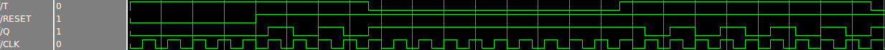

# SO Topic for Digital Systems course

## How to design combinatorial and sequential processes in VHDL

### Differences between combinatorial and sequential logic circuits:


* In general there are two kind of logic circuits:

 
  
 > Combinatorial circuits in which the outputs depend only on the input values through a boolean function. In other words a combinatorial circuit is such that it has not inferred memory elements.
   

 
 > Sequential circuits in which the outputs depend on the input values and the story of the circuit. In these kind of circuits are needed memory elements.


### VHDL code for combinatorial circuits
Combinatorial circuits can be described in vhdl using normal concurrent signal assignments or using a process. Since there are not memory elements, all assigned signals in a process are always explicitly assigned in all paths of the process statements.

Combinatorial processes have a sensitivity list after the sintax element "process". To specify such kind of processes there are two ways in which it is possible to populate this sensitivity list:
* writing all signals that, having an event, may resume a process;
* leave the sensitivity list empty and use a wait statement such as wait on "the same value used in the sensitivity list in the previous point";

The process is activated if a value change appears on one of the sensitivity list signals or in the signals stated in the wait statement.

Describing a combinatorial process means that all signals that appear in the process must be present in the sensitivity list or in the wait statement. If a signal is not included can lead to unwanted behaviours.
To avoid this problem in VHDL2008 it is possible to use the "all" keyword in the sensitivity list avoiding to specify all signals one by one.


```vhdl
entity H_A is
port(
    A: in bit;
    B: in bit;
    S: out bit;
    C: out bit
    );
end H_A;

architecture beh of H_A is
begin
    process(A,B)
    begin
        S <= A xor B;
        C <= A and B;
    end process;
end beh;

```
### VHDL code for sequential logic circuits
Sequential logic circuits have a dependence between the values of the outputs and the previous values of the inputs. (as well as the current values of the inputs)

This suggest that this kind of circuits have memory elements. There are different kind of sequential logic circuits: synchronous and asynchronous. 

Since the purpose of this examples is to show differences between combinatorial and sequential circuits, we won't go into the details of sequential circuits but we will see only synchronous sequential circuits.

In synchronous circuits, as the name suggest, the changes in the state of memory elements are synchronized by a signal called clock.

Since the clock lead to a state change it must be present in the sensitivity list.

A simple example of a synchronous sequential logic circuits is described below:

```vhdl
entity T_FF is
port(
    T:     in  std_logic;
    CLK:   in  std_logic;
    RESET: in  std_logic;
    Q:     out std_logic 
    );
end T_FF;

architecture beh of T_FF is
signal Q_sig: std_logic;
begin
    process(CLK,RESET)
    begin
        if (RESET='0') then
                Q_sig <= '0';
        elsif CLK'event and (CLK = '1') then
	        if (T='1') then            
	            Q_sig <= not Q_sig;
	        end if;
        end if;
    end process;
    Q <= Q_sig;
end beh;

```



